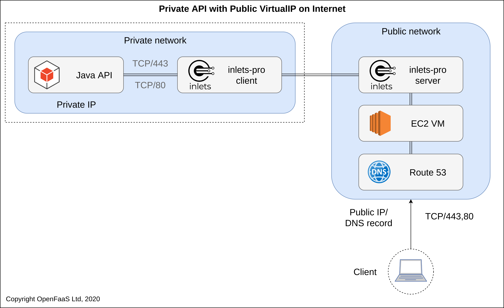
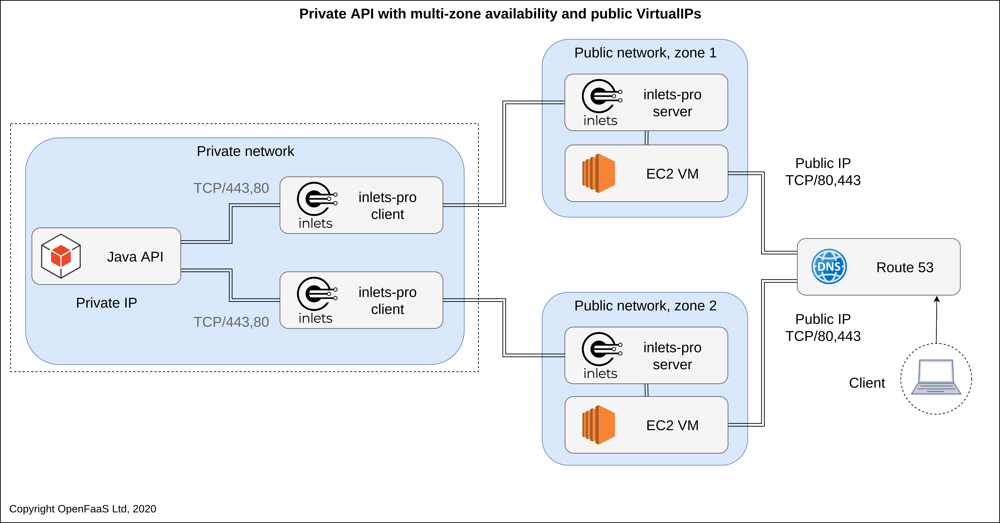
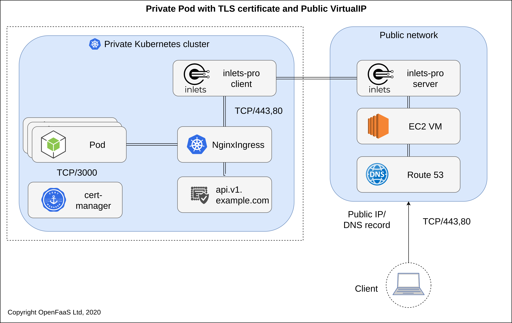

# inlets pro

inlets-pro is a Cloud Native Tunnel for L4 TCP traffic

# Overview

You can use inlets-pro to tunnel out any TCP traffic from an internal network to another network. This could be green-to-green, or green-to-red, i.e. from internal/private to the Internet. It differs from [Inlets OSS](https://inlets.dev/) in that it works at the L4 of the TCP stack and has automatic TLS (auto-tls) encryption built-in.

Given the split control- and data-plane, you can also punch out endpoints into a remote cluster, which are kept private from the Internet, for instance when you need Command & Control, or orchestration of on-premises services, from a central cloud cluster.


## Features

inlets-pro forwards TCP traffic over an encrypted websocket secured with TLS.

* Support for any TCP protocol
* Pass-through L4 proxy
* Automatic TLS encryption for tunnel and control-port
* Automatic port-detection, announced by client

Deployment options:

* single static binary is available for MacOS, Windows, and Linux on armhf and ARM64
* `systemd` support with automatic restarts
* Native `docker` image available
* Kubernetes integration via `inlets-operator` or YAML

## Reference architecture

inlets-pro can be used to provide a Public VirtualIP to private, edge and on-premises services and Kubernetes clusters. Once you have set up one or more VMs or cloud hosts on public cloud, you can utilize their IP addresses with inlets-pro.

You can get incoming networking (ingress) to any:

* Command & control of Point of Sale / IoT devices
* SSH access to home-lab or Raspberry Pi
* TCP services running on Linux, Windows or MacOS
* The API of your Kubernetes cluster
* A VM or Docker container

For example, rather than terminating TLS at the edge of the tunnel, inlets-pro can forward the TLS traffic on port `443` directly to your host, where you can run a reverse proxy inside your network. At any time you can disconnect and reconnect the tunnel or even delete the remote VM without loosing your TLS certificate since it's stored locally.

### Single private service with Public VirtualIP



For a single private on-premises Java API service, one exit-server is provisioned on public cloud, its Public IP is the VirtualIP for the private cluster. Ports 80 and 443 are forwarded to the Java API, which can serve its own TLS certificate.

### Single private service with Highly-available, multi-zone Public VirtualIP and DNS



For a single private on-premises Java API service, two exit-servers are provisioned on public cloud, each with a Public VirtualIP. DNS is used to provide high-availability and fail-over. Ports 80 and 443 are forwarded to the Java API, which can serve its own TLS certificate.

### Private Kubernetes Cluster, High-available Pod, public VirtualIP



Example: A private or on-premises Kubernetes cluster serving traffic from a Node.js Pod on port 3000. An IngressController performs TLS termination and stores a certificate within the private cluster. The certificate can be obtained from LetsEncrypt using standard tooling such as [cert-manager](https://cert-manager.io/docs/).

### Remote TCP service running on client site, edge, or on-premises. Command and control from central location


Example: You have a remote TCP service such as a PostgreSQL database which is running in a private network such as a client's site, at an edge location, or on-premises. You need to access that database from a public or central cluster. The PostgreSQL database must not be exposed on the Internet, and a split-plane is used where only the control-plane of inlets-pro is public. From within your destination cluster, services can access the database via a private ClusterIP.

## Get started

You can follow one of the tutorials above, or use inlets-pro in three different ways:

* As a stand-alone binary which you can manage manually, or automate
* Through [inletsctl](https://github.com/inlets/inletsctl) which creates an exit server with `inlets-pro server` running with systemd in one of the cloud / IaaS platforms such as AWS EC2 or DigitalOcean
* Through [inlets-operator](https://github.com/inlets/inlets-operator) - the operator runs on Kubernetes and creates an exit server running `inlets-pro server` and a Pod in your cluster running `inlets-pro client`. The lifecycle of the client and server and exit-node are all automated.

### Tutorials and examples

In this example we will forward ports 80 and 443 from the exit-node to the IngressController running within the cluster. We could forward anything that can be transported over TCP i.e. TLS, MongoDB, SSH, Redis, or whatever you want.

* [inlets-pro CLI reference](docs/cli-reference.md)

* [TCP tunnel for your Kubernetes IngressController HTTP/80 and TLS/443](ingress-tutorial.md)
* [TCP tunnel for Apache Cassandra running on your local machine, out to another network](cassandra-tutorial.md)
* [TCP tunnel for Caddy - get a TLS cert directly for your local machine](caddy-tutorial.md)
* [TCP tunnel to access an SSH server](ssh-tutorial.md)
* [Get kubectl access to your private cluster from anywhere](https://blog.alexellis.io/get-private-kubectl-access-anywhere/)

### Get the binary

Both the client and server are contained within the same binary. It is recommended that you use inletsctl, or inlets-operator to access inlets-pro, but you can also work directly with its binary or Docker image.

The inlets-pro binary can be obtained as a stand-alone executable, or via a Docker image.

* As a binary:

    ```sh
    curl -SLsf https://github.com/inlets/inlets-pro/releases/download/0.4.3/inlets-pro > inlets-pro
    chmod +x ./inlets-pro
    ```
        
    Or fetch via `inletsctl download --pro`

    Or find a binary for [a different architecture on the releases page](https://github.com/inlets/inlets-pro/releases)

* Docker

    A docker image is published at `inlets/inlets-pro:0.5.1`

* Kubernetes YAML files

    A [client](artifacts/client.yaml) and [server](artifacts/server.yaml) YAML file are also available as samples

    Or you can see the [CLI reference guide](docs/cli-reference.md)

## License

[inlets OSS](https://inlets.dev) is a free, L7 HTTP tunnel project available for use under the MIT license.

inlets-pro is a L4 TCP tunnel, service proxy, and load-balancer product distributed under a commercial license.

In order to use inlets-pro, you must accept the [End User License Agreement - EULA](EULA.md). The server component runs without a license key, but the client requires a valid license. A license can be purchased from OpenFaaS Ltd after completing a trial.

Professional services are also available if you would like to conduct a paid proof-of-concept or to obtain a custom reference architecture. Just ask us how we can help.

### Getting a license key

1) Accept the [End User License Agreement - EULA](EULA.md)
2) [Start a 14-day trial today](https://docs.google.com/forms/d/e/1FAIpQLScfNQr1o_Ctu_6vbMoTJ0xwZKZ3Hszu9C-8GJGWw1Fnebzz-g/viewform?usp=sf_link)
2) Receive your license via email from OpenFaaS Ltd
3) Use community support if required via [OpenFaaS Slack](https://slack.openfaas.io/) in the #inlets channel

**After completing your trial**, please contact [sales@openfaas.com](mailto:sales@openfaas.com) for a quote and to purchase a commercial-license.
